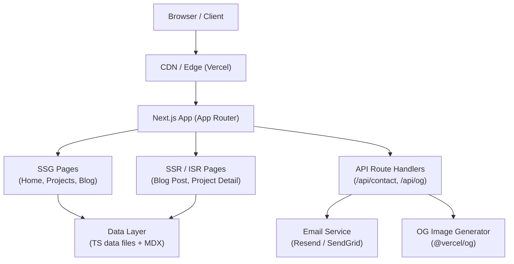
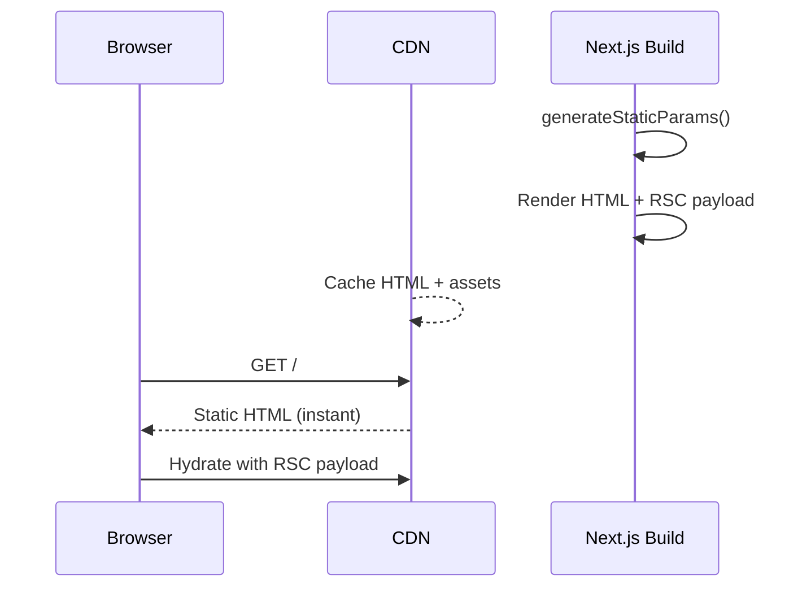
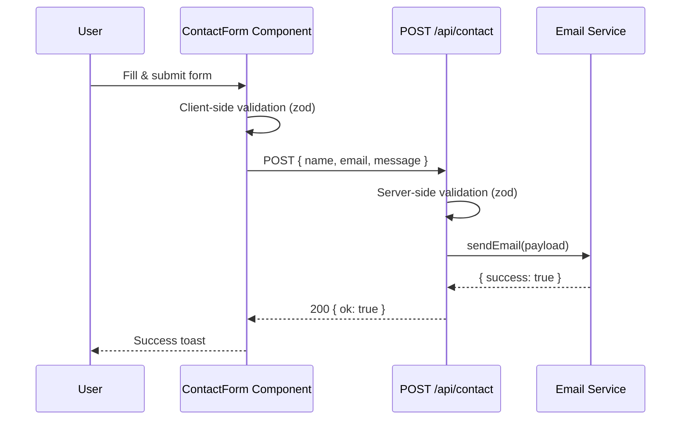

# Design Document: Personal Portfolio Website — Abel Amare

## Overview

Abel Amare's personal portfolio is a modern, SEO-optimised, fully responsive website built with **Next.js 14 (App Router)**. It showcases Abel's skills, projects, work history, and contact information to potential employers and collaborators. The site leverages Static Site Generation (SSG) for content-heavy pages and Server-Side Rendering (SSR) where dynamic data is needed, giving it excellent Core Web Vitals scores and search-engine visibility.

The application is structured as a single Next.js project using the App Router with TypeScript, Tailwind CSS for styling, and MDX for blog content authoring. All portfolio data (projects, experience, skills) is stored in structured TypeScript data files so Abel can update content without touching UI code. An optional contact form posts to a Next.js Route Handler that forwards messages via a transactional email API.

---

## Architecture



---

## Sequence Diagrams

### Page Load — SSG (Home / Projects)



### Contact Form Submission



---

## Components and Interfaces

### NavBar

**Purpose**: Sticky top navigation with logo, section links, dark-mode toggle, and mobile hamburger menu.

**Interface**:
```typescript
interface NavBarProps {
  links: NavLink[]
  ctaLabel?: string
  ctaHref?: string
}

interface NavLink {
  label: string
  href: string
}
```

**Responsibilities**:
- Render desktop and mobile navigation
- Highlight active section via `useActiveSection` hook
- Toggle dark / light theme and persist preference in localStorage

---

### HeroSection

**Purpose**: Full-viewport landing section with name, title, tagline, CTA buttons, and animated entrance.

**Interface**:
```typescript
interface HeroProps {
  name: string
  title: string
  tagline: string
  avatarSrc: string
  ctaPrimary: { label: string; href: string }
  ctaSecondary: { label: string; href: string }
  socialLinks: SocialLink[]
}
```

**Responsibilities**:
- Render above-the-fold content with optimised LCP image (`next/image`)
- Trigger entrance animations (Framer Motion)
- Provide direct download link for résumé PDF

---

### AboutSection

**Purpose**: Short biography with photo, personality traits, and fun facts.

**Interface**:
```typescript
interface AboutProps {
  bio: string
  highlights: string[]
  photoSrc: string
}
```

---

### SkillsSection

**Purpose**: Visual display of technical skills grouped by category.

**Interface**:
```typescript
interface SkillsSectionProps {
  categories: SkillCategory[]
}

interface SkillCategory {
  name: string
  skills: Skill[]
}

interface Skill {
  name: string
  iconSrc?: string
  level?: 'beginner' | 'intermediate' | 'advanced' | 'expert'
}
```

**Real skill categories pre-populated in `data/skills.ts`**:

| Category | Skills |
|---|---|
| Mobile | Flutter, Dart |
| Frontend | Next.js, React, TypeScript, Tailwind CSS, Redux Toolkit, Framer Motion |
| Backend | Node.js, Express, Java 17, Spring Boot 3, Spring Security |
| Databases | PostgreSQL, Knex.js, Spring Data JPA, Flyway |
| DevOps & Tools | Docker, Docker Compose, GitHub Actions, Maven |
| Payments & APIs | Chapa, JWT, REST APIs |
| Languages | TypeScript, Dart, Java, JavaScript |

---

### ProjectsSection / ProjectCard

**Purpose**: Filterable grid of project cards with links to live demo and source.

**Interface**:
```typescript
interface Project {
  id: string
  title: string
  description: string
  techStack: string[]
  imageUrl: string
  liveUrl?: string
  repoUrl?: string
  featured: boolean
  tags: string[]
  highlights?: string[]   // key bullet points shown on card expand
}

interface ProjectCardProps {
  project: Project
}

interface ProjectsSectionProps {
  projects: Project[]
}
```

**Responsibilities**:
- Filter projects by tag (client component)
- Lazy-load project images with `next/image`
- Show featured badge on highlighted projects

---

### Real Project Data

The two featured projects are pre-populated in `data/projects.ts`:

#### LegalCase — Legal Practice Management Platform

```typescript
{
  id: 'legalcase',
  title: 'LegalCase',
  description:
    'Full-stack SaaS platform for Ethiopian law firms — combines a Flutter mobile app, ' +
    'Node.js/TypeScript REST API, and a React admin panel into one cohesive product.',
  techStack: [
    'Flutter', 'Dart', 'Node.js', 'TypeScript', 'Express',
    'PostgreSQL', 'Knex.js', 'React', 'Vite', 'JWT', 'Docker',
    'GitHub Actions', 'Chapa',
  ],
  imageUrl: '/images/projects/legalcase.png',
  featured: true,
  tags: ['mobile', 'backend', 'saas', 'fintech', 'fullstack'],
  highlights: [
    '40+ REST API endpoints with role-based access & subscription guard middleware',
    'Alarm-style hearing notifications that survive app kill and device reboot (USE_EXACT_ALARM + BOOT_COMPLETED)',
    'Chapa payment gateway integration with free-trial enforcement and 402 paywall',
    'Bilingual UI — English & Amharic (አማርኛ)',
    '18 database migrations · 15+ mobile screens · monorepo architecture',
  ],
}
```

#### Cooperative Management System

```typescript
{
  id: 'cooperative-mgmt',
  title: 'Cooperative Management System',
  description:
    'Full-stack digital platform replacing paper-based processes for an employees\' ' +
    'savings & credit cooperative — member lifecycle, loan management, payroll ' +
    'integration, and a complete general ledger.',
  techStack: [
    'Java 17', 'Spring Boot 3', 'Spring Security', 'JWT',
    'Spring Data JPA', 'PostgreSQL', 'Flyway', 'Maven',
    'Next.js 14', 'TypeScript', 'Redux Toolkit', 'RTK Query', 'Tailwind CSS',
  ],
  imageUrl: '/images/projects/cooperative.png',
  featured: true,
  tags: ['backend', 'fintech', 'fullstack', 'java', 'nextjs'],
  highlights: [
    'FIFO loan queue enforcement with two-level skip workflow (officer requests, manager approves)',
    'LTV-adjusted collateral coverage — four collateral types including locked savings and external cooperative',
    'Versioned system config — every transaction locks the config active at that time, no retroactive changes',
    'Dual-write financial tracking — member account + cooperative general ledger in the same DB transaction',
    '~25 REST controllers · 24 Flyway migrations · ~40 frontend pages · 5 RBAC roles',
  ],
}
```

---

### ExperienceSection / ExperienceTimeline

**Purpose**: Vertical timeline of work history with role, company, dates, and bullet achievements.

**Interface**:
```typescript
interface WorkExperience {
  id: string
  role: string
  company: string
  location: string
  startDate: string   // ISO 8601
  endDate?: string    // undefined = present
  description: string[]
  technologies: string[]
  logoUrl?: string
}

interface ExperienceTimelineProps {
  experiences: WorkExperience[]
}
```

---

### ContactSection

**Purpose**: Contact form with email, name, message fields and validation.

**Interface**:
```typescript
interface ContactFormValues {
  name: string
  email: string
  subject?: string
  message: string
}

interface ContactFormState {
  status: 'idle' | 'submitting' | 'success' | 'error'
  errorMessage?: string
}
```

---

### BlogSection / PostCard

**Purpose**: Grid of blog post previews loaded from MDX files.

**Interface**:
```typescript
interface BlogPost {
  slug: string
  title: string
  summary: string
  publishedAt: string
  tags: string[]
  coverImage?: string
  readingTimeMinutes: number
}

interface PostCardProps {
  post: BlogPost
}
```

---

## Data Models

### Site Metadata

```typescript
interface SiteMetadata {
  title: string
  description: string
  url: string
  ogImage: string
  twitterHandle: string
  author: string
}
```

### Contact Request (API payload)

```typescript
// Zod schema — source of truth for validation
const contactSchema = z.object({
  name: z.string().min(2).max(100),
  email: z.string().email(),
  subject: z.string().max(200).optional(),
  message: z.string().min(10).max(2000),
})

type ContactRequest = z.infer<typeof contactSchema>
```

### Blog Post Frontmatter

```typescript
interface BlogFrontmatter {
  title: string
  summary: string
  publishedAt: string          // "YYYY-MM-DD"
  tags: string[]
  coverImage?: string
  draft?: boolean
}
```

---

## Key Functions with Formal Specifications

### `getAllProjects()`

```typescript
function getAllProjects(): Project[]
```

**Preconditions:**
- `data/projects.ts` exports a valid `Project[]` array
- Each project has a unique `id`

**Postconditions:**
- Returns the full project list, sorted by `featured` first then by insertion order
- Array length ≥ 0

**Loop Invariants:** N/A (array sort, no explicit loop)

---

### `getFeaturedProjects(limit?: number)`

```typescript
function getFeaturedProjects(limit?: number): Project[]
```

**Preconditions:**
- `limit` is undefined or a positive integer

**Postconditions:**
- Returns only projects where `featured === true`
- If `limit` provided: `result.length ≤ limit`
- Order is preserved from source data

---

### `getAllPosts()`

```typescript
async function getAllPosts(): Promise<BlogPost[]>
```

**Preconditions:**
- `content/blog/` directory exists and is readable

**Postconditions:**
- Returns posts sorted by `publishedAt` descending
- Posts with `draft: true` are excluded in production (`NODE_ENV === 'production'`)
- Each returned post has all required `BlogPost` fields populated

---

### `getPostBySlug(slug: string)`

```typescript
async function getPostBySlug(slug: string): Promise<BlogPost & { content: string } | null>
```

**Preconditions:**
- `slug` is a non-empty string

**Postconditions:**
- Returns full post data including MDX content string if slug matches a file
- Returns `null` if no matching file found
- Never throws; errors are caught and return `null`

---

### `sendContactEmail(payload: ContactRequest)`

```typescript
async function sendContactEmail(payload: ContactRequest): Promise<{ ok: boolean; error?: string }>
```

**Preconditions:**
- `payload` passes Zod validation
- `EMAIL_API_KEY` environment variable is set

**Postconditions:**
- On success: returns `{ ok: true }`
- On failure: returns `{ ok: false, error: string }` — never throws
- Exactly one email is sent per invocation

---

### `generateMetadata(params)` — Next.js page metadata

```typescript
async function generateMetadata(
  { params }: { params: { slug: string } }
): Promise<Metadata>
```

**Preconditions:**
- `params.slug` corresponds to an existing blog post or project

**Postconditions:**
- Returns valid Next.js `Metadata` object
- `openGraph.images` contains at least one OG image URL
- Falls back to site defaults if post/project not found

---

## Algorithmic Pseudocode

### Active Section Detection (scroll-spy)

```pascal
ALGORITHM useActiveSection(sectionIds)
INPUT: sectionIds — array of DOM element IDs
OUTPUT: activeId — reactive string (state)

BEGIN
  activeId ← sectionIds[0]

  // Set up IntersectionObserver for all sections
  observer ← new IntersectionObserver(
    threshold: 0.5,
    rootMargin: "-80px 0px 0px 0px"   // account for sticky nav height
  )

  FOR each id IN sectionIds DO
    element ← document.getElementById(id)
    IF element IS NOT NULL THEN
      observer.observe(element)
    END IF
  END FOR

  // Callback fires when section crosses threshold
  ON observer.callback(entries) DO
    FOR each entry IN entries DO
      IF entry.isIntersecting THEN
        activeId ← entry.target.id
      END IF
    END FOR
  END ON

  // Cleanup on unmount
  ON cleanup DO
    observer.disconnect()
  END ON

  RETURN activeId
END
```

**Loop Invariants:**
- All previously observed sections remain observed until cleanup
- `activeId` always holds a valid value from `sectionIds`

---

### Projects Tag Filter

```pascal
ALGORITHM filterProjects(projects, selectedTags)
INPUT:
  projects   — Project[]
  selectedTags — Set<string>
OUTPUT: filtered — Project[]

BEGIN
  IF selectedTags IS EMPTY THEN
    RETURN projects
  END IF

  filtered ← []

  FOR each project IN projects DO
    // Project matches if it has at least one selected tag
    hasMatch ← false
    FOR each tag IN project.tags DO
      IF tag IN selectedTags THEN
        hasMatch ← true
        BREAK
      END IF
    END FOR

    IF hasMatch THEN
      filtered.append(project)
    END IF
  END FOR

  RETURN filtered
END
```

**Preconditions:**
- `projects` is a valid array (may be empty)
- `selectedTags` is a Set

**Postconditions:**
- If `selectedTags` is empty, all projects are returned unchanged
- Every returned project contains at least one tag from `selectedTags`
- Order of projects is preserved from input

**Loop Invariants:**
- `filtered` contains only projects that have been fully evaluated
- No project appears in `filtered` more than once

---

### Reading Time Calculation

```pascal
ALGORITHM calculateReadingTime(content)
INPUT: content — string (raw MDX/Markdown)
OUTPUT: minutes — positive integer

BEGIN
  WORDS_PER_MINUTE ← 200

  // Strip MDX/Markdown syntax to count only prose words
  plainText ← stripMarkdown(content)
  wordCount ← plainText.split(/\s+/).filter(w => w.length > 0).length

  minutes ← ceil(wordCount / WORDS_PER_MINUTE)
  minutes ← max(minutes, 1)   // minimum 1 minute

  RETURN minutes
END
```

**Postconditions:**
- Returns integer ≥ 1
- Deterministic for same input

---

### Contact Form Submission Flow

```pascal
ALGORITHM submitContactForm(formValues)
INPUT: formValues — ContactFormValues
OUTPUT: void (side-effects: state updates, toast notification)

BEGIN
  // 1. Client-side validation
  result ← contactSchema.safeParse(formValues)
  IF result.success = false THEN
    SET fieldErrors from result.error.flatten()
    RETURN
  END IF

  // 2. Transition to submitting state
  SET status ← "submitting"

  // 3. POST to route handler
  TRY
    response ← await fetch("/api/contact", {
      method: "POST",
      body: JSON.stringify(result.data)
    })

    IF response.ok THEN
      SET status ← "success"
      SHOW success toast
      RESET form fields
    ELSE
      data ← await response.json()
      SET status ← "error"
      SET errorMessage ← data.error OR "Something went wrong"
    END IF

  CATCH networkError DO
    SET status ← "error"
    SET errorMessage ← "Network error — please try again"
  END TRY
END
```

---

## Example Usage

### Loading Projects in a Page Component

```typescript
// app/projects/page.tsx
import { getAllProjects } from '@/lib/data/projects'
import { ProjectsSection } from '@/components/sections/ProjectsSection'
import type { Metadata } from 'next'

export const metadata: Metadata = {
  title: 'Projects — Abel Amare',
  description: 'Full-stack projects built by Abel Amare',
}

// SSG — built at compile time, no runtime cost
export default function ProjectsPage() {
  const projects = getAllProjects()
  return <ProjectsSection projects={projects} />
}
```

### Blog Post Page with Dynamic Metadata

```typescript
// app/blog/[slug]/page.tsx
import { getPostBySlug, getAllPosts } from '@/lib/data/blog'
import { notFound } from 'next/navigation'
import type { Metadata } from 'next'

export async function generateStaticParams() {
  const posts = await getAllPosts()
  return posts.map((p) => ({ slug: p.slug }))
}

export async function generateMetadata(
  { params }: { params: { slug: string } }
): Promise<Metadata> {
  const post = await getPostBySlug(params.slug)
  if (!post) return {}
  return {
    title: `${post.title} — Abel Amare`,
    description: post.summary,
    openGraph: {
      images: [`/api/og?title=${encodeURIComponent(post.title)}`],
    },
  }
}

export default async function BlogPostPage(
  { params }: { params: { slug: string } }
) {
  const post = await getPostBySlug(params.slug)
  if (!post) notFound()
  return <article>{/* render MDX content */}</article>
}
```

### Contact Route Handler

```typescript
// app/api/contact/route.ts
import { NextRequest, NextResponse } from 'next/server'
import { contactSchema } from '@/lib/validations/contact'
import { sendContactEmail } from '@/lib/email'

export async function POST(req: NextRequest) {
  const body = await req.json()
  const result = contactSchema.safeParse(body)

  if (!result.success) {
    return NextResponse.json(
      { error: 'Invalid request', details: result.error.flatten() },
      { status: 400 }
    )
  }

  const { ok, error } = await sendContactEmail(result.data)
  if (!ok) {
    return NextResponse.json({ error }, { status: 500 })
  }

  return NextResponse.json({ ok: true }, { status: 200 })
}
```

---

## Correctness Properties

### Property 1: Project ID Uniqueness

∀ project ∈ `getAllProjects()` → `project.id` is unique across the array.

```typescript
// fast-check property
fc.assert(
  fc.property(fc.array(arbitraryProject()), (projects) => {
    const ids = getAllProjects().map((p) => p.id)
    return new Set(ids).size === ids.length
  })
)
```

### Property 2: No Draft Posts in Production

∀ post ∈ `getAllPosts()` when `NODE_ENV === 'production'` → `post.draft !== true`.

```typescript
fc.assert(
  fc.property(fc.anything(), async () => {
    const posts = await getAllPosts()
    return posts.every((p) => !p.draft)
  })
)
```

### Property 3: Contact Form Terminal State

∀ contact form submission → `status` transitions to exactly one of `'success'` or `'error'`; never remains `'submitting'` indefinitely.

### Property 4: getPostBySlug Returns Complete Data or Null

∀ `getPostBySlug(slug)` call → returns `null` or a fully-hydrated `BlogPost` (never a partial object missing required fields).

```typescript
fc.assert(
  fc.property(fc.string(), async (slug) => {
    const post = await getPostBySlug(slug)
    if (post === null) return true
    return (
      typeof post.title === 'string' &&
      typeof post.slug === 'string' &&
      typeof post.summary === 'string' &&
      typeof post.publishedAt === 'string'
    )
  })
)
```

### Property 5: Filter Is a Subset

∀ `filterProjects(projects, tags)` → result is always a subset of `projects` and every returned project satisfies `project.tags ∩ tags ≠ ∅` when `tags.size > 0`.

```typescript
fc.assert(
  fc.property(
    fc.array(arbitraryProject()),
    fc.set(fc.string()),
    (projects, selectedTags) => {
      const tagSet = new Set(selectedTags)
      const result = filterProjects(projects, tagSet)
      // Subset property
      const isSubset = result.every((r) => projects.includes(r))
      // Intersection property
      const hasMatch =
        tagSet.size === 0 ||
        result.every((r) => r.tags.some((t) => tagSet.has(t)))
      return isSubset && hasMatch
    }
  )
)
```

### Property 6: Reading Time Minimum

∀ `calculateReadingTime(content)` where `content` is a non-empty string → result ≥ 1.

```typescript
fc.assert(
  fc.property(fc.string({ minLength: 1 }), (content) => {
    return calculateReadingTime(content) >= 1
  })
)
```

### Property 7: Metadata Never Throws

`generateMetadata` is total — for any slug input it always returns a valid `Metadata` object and never throws.

---

## Error Handling

### Scenario 1: Contact Form — Email API Down

**Condition**: Email service returns non-2xx or network timeout
**Response**: Route handler catches error, returns `500 { error: "Failed to send message" }`
**Recovery**: Client shows retry prompt with original form values intact

### Scenario 2: Blog Post Not Found

**Condition**: `getPostBySlug` returns `null` (slug doesn't match any MDX file)
**Response**: Next.js `notFound()` is called, rendering the 404 page
**Recovery**: Not required — intentional 404

### Scenario 3: Missing Environment Variable

**Condition**: `EMAIL_API_KEY` not set in production
**Response**: `sendContactEmail` returns `{ ok: false, error: "Email service not configured" }`
**Recovery**: Site operator adds the variable to Vercel environment settings

### Scenario 4: Invalid Form Data (server-side re-check)

**Condition**: Malformed JSON or schema violation in `/api/contact`
**Response**: 400 with `{ error: "Invalid request", details: ... }`
**Recovery**: Client shows field-level error messages

---

## Testing Strategy

### Unit Testing Approach

Use **Vitest** (native ESM, fast). Key unit test targets:
- `getAllProjects()` — correct sort order, deduplication
- `filterProjects()` — empty tags returns all, tag intersection logic
- `calculateReadingTime()` — boundary values (empty string, single word, long article)
- `contactSchema` — valid/invalid payloads
- `getPostBySlug()` — missing slug returns null, draft excluded in prod

### Property-Based Testing Approach

**Property Test Library**: `fast-check`

Key properties to test:
- `filterProjects(projects, tags)` — if `tags` is empty, result equals input regardless of project data
- `calculateReadingTime(s)` — result ≥ 1 for any non-empty string
- `contactSchema` — any object missing required fields fails validation
- `filterProjects` — result is always a subset of input array

### Integration Testing Approach

Use **Playwright** for E2E:
- Navigation: clicking section links scrolls to correct anchor
- Contact form: fill → submit → success toast visible
- Projects filter: selecting a tag reduces visible cards
- Blog: clicking a post card navigates to full post page
- Dark mode: toggle persists across page navigation (localStorage)

---

## Performance Considerations

- All content pages use **SSG** (`generateStaticParams`); no per-request compute cost for visitors
- Images served via `next/image` with automatic WebP conversion and lazy loading
- Hero avatar uses `priority` prop for immediate LCP
- Blog MDX compiled at build time — zero runtime parsing
- Route Handler for OG images uses `@vercel/og` (edge runtime, <1ms cold start)
- Tailwind CSS purges unused styles at build — CSS bundle < 10 KB
- Inter / Geist font loaded via `next/font` with `display: swap` to prevent layout shift

---

## Security Considerations

- Contact form protected with **server-side Zod validation** — no raw user input reaches email API
- `EMAIL_API_KEY` and any other secrets stored in environment variables, never committed
- No database or authentication surface to attack
- Content Security Policy headers configured via `next.config.ts` `headers()` function
- OG image route is read-only and takes only a `title` query parameter (no user-controlled HTML)
- Résumé PDF served as static asset — no execution path

---

## File / Directory Structure

```
portfolio/
├── app/
│   ├── layout.tsx                  # Root layout (NavBar, Footer, ThemeProvider)
│   ├── page.tsx                    # Home page (all one-page sections)
│   ├── projects/
│   │   └── page.tsx                # Dedicated projects page
│   ├── blog/
│   │   ├── page.tsx                # Blog index
│   │   └── [slug]/
│   │       └── page.tsx            # Blog post page
│   └── api/
│       ├── contact/
│       │   └── route.ts            # POST /api/contact
│       └── og/
│           └── route.tsx           # GET /api/og (OG image generation)
├── components/
│   ├── layout/
│   │   ├── NavBar.tsx
│   │   └── Footer.tsx
│   ├── sections/
│   │   ├── HeroSection.tsx
│   │   ├── AboutSection.tsx
│   │   ├── SkillsSection.tsx
│   │   ├── ProjectsSection.tsx
│   │   ├── ExperienceSection.tsx
│   │   ├── ContactSection.tsx
│   │   └── BlogSection.tsx
│   └── ui/
│       ├── Button.tsx
│       ├── ProjectCard.tsx
│       ├── PostCard.tsx
│       ├── SkillBadge.tsx
│       ├── ExperienceTimeline.tsx
│       └── ThemeToggle.tsx
├── content/
│   └── blog/
│       └── *.mdx                   # Blog posts
├── data/
│   ├── projects.ts                 # Project[] data
│   ├── experience.ts               # WorkExperience[] data
│   ├── skills.ts                   # SkillCategory[] data
│   └── site.ts                     # SiteMetadata
├── lib/
│   ├── data/
│   │   ├── projects.ts             # getAllProjects(), getFeaturedProjects()
│   │   └── blog.ts                 # getAllPosts(), getPostBySlug()
│   ├── email.ts                    # sendContactEmail()
│   ├── reading-time.ts             # calculateReadingTime()
│   └── validations/
│       └── contact.ts              # contactSchema (Zod)
├── hooks/
│   ├── useActiveSection.ts
│   └── useTheme.ts
├── public/
│   ├── resume.pdf
│   └── images/
├── next.config.ts
├── tailwind.config.ts
└── tsconfig.json
```

---

## Dependencies

| Package | Purpose |
|---|---|
| `next` (14+) | App Router, SSG/SSR, Image Optimisation |
| `react`, `react-dom` | UI rendering |
| `typescript` | Type safety |
| `tailwindcss` | Utility-first CSS |
| `framer-motion` | Entrance animations |
| `@next/mdx` + `next-mdx-remote` | MDX blog authoring |
| `zod` | Schema validation (forms + API) |
| `react-hook-form` | Form state management |
| `resend` (or `@sendgrid/mail`) | Transactional email |
| `@vercel/og` | Edge OG image generation |
| `next/font` | Self-hosted web fonts |
| `vitest` | Unit testing |
| `fast-check` | Property-based testing |
| `@playwright/test` | E2E testing |
| `lucide-react` | Icon library |
